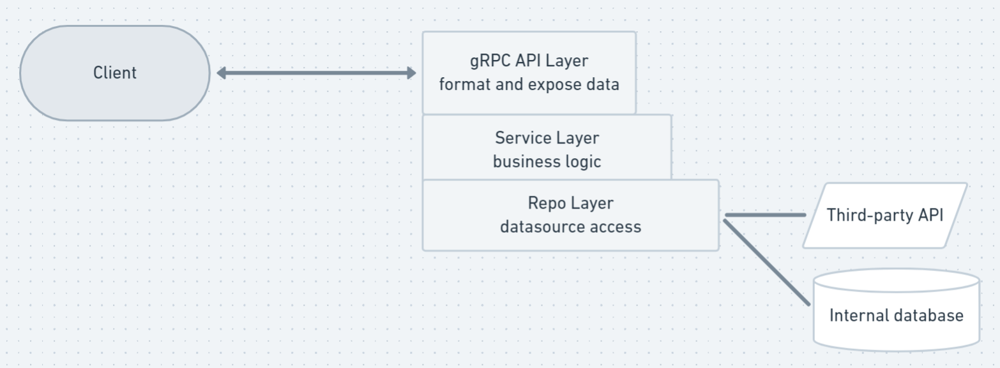

# gRPC backend test
A sample application using gRPC for client-server communicaiton.

## Try it
Compile the programs: `sh build.sh`

The executables are written in `./dist`

Open one terminal: `./dist/server`
On another terminal: `./dist/client -breed boxer -output ./boxer.jpg`

## Architecture

There are three layers:
- The API layer accepts and forward the request to the `DogService`, then format the response
- The service layer is designed to handle business logic. We are not adding logic here yet.
- The repo layer is responsible for accessing datasources, either from internal databases or third-party systems.

## Development
tldr; `sh setup.sh`

Setup `protoc` and `gRPC` for Go:
- Install Go compiler
- Install protobuf compiler (protoc)
- Install go language binding for protobuf
- Install go rRPC server scaffolder 

Run the server:
- `cd ./cmd/server/; go run .`

Run the client:
- `cd ./cmd/client/; go run . -breed boxer -output breed.jpg`
